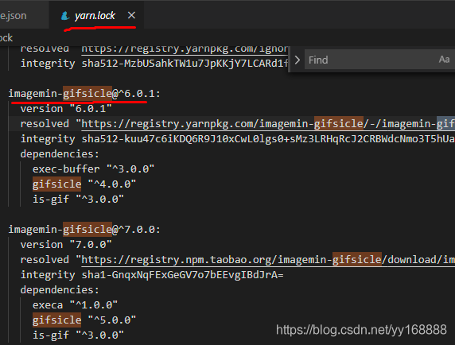

从github上clone别人的代码，install时报错如下：
```
Output:
‼ connect ETIMEDOUT
‼ gifsicle pre-build test failed
i compiling from source
```

查看gifsicle，百度了一下，发现这个是一个gif图片压缩的命令行工具。查看yarn.lock找到imagemin-gifsicle。好像是因为gulp-imagemin将其插件以来依赖项指定为"optional", 而实际上并不是如此。在大多数情况下可以使用npm起作用，但是使用yarn时，当尝试使用images gulp任务是就会报错，对于缺失的依赖项建议手动安装。

手动安装
```
yarn add imagemin-jpegtran imagemin-svgo imagemin-gifsicle imagemin-optipng --dev
```
ok，成功，再使用yarn