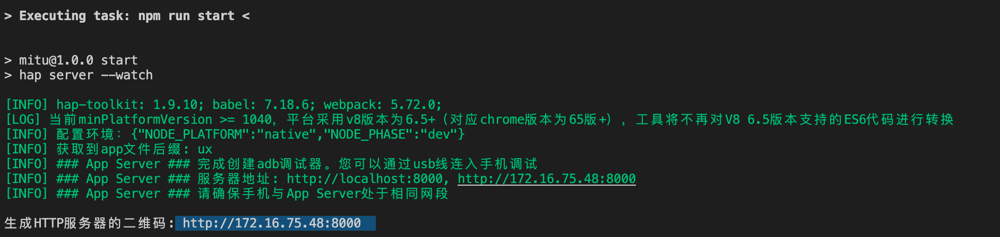

quickapp 快应用像是以小程序+Vue为基础可以在各大安卓厂商应用平台上免安装使用包,官网： `https://doc.quickapp.cn/`

开发工具

1.可以使用官方推荐的IDE ： 下载地址

但是官方提供的工具与prettier等个别插件有冲突，导致编辑时光标等不灵敏/输入失败

2.安装NodeJS

需安装6.0以上版本的NodeJS，请从NodeJS官网下载，比如：v6.11

注意: 不要使用8.0.*版本．这个版本内部ZipStream实现与node-archive包不兼容，会引起报错

3.安装工具

通过npm仓库安装，在命令行中执行以下命令：

`npm install -g hap-toolkit`

在命令行中执行hap -V会输出版本信息表示hap-toolkit安装成功，如下命令所示：

`hap -V`

4.创建新工程

用来创建一个模板工程项目

`hap init <ProjectName>`

进入工程的根目录运行如下命令安装依赖包

`npm install`

5.升级工程

用来进行常规工程目录结构与依赖的升级,进入已经建好的工程目录中

`hap update`

命令参数：

--force 强制升级（将当前工程升级到hap-toolkit版本, 有可能导致版本降级，请谨慎使用）

升级完成后，在工程目录中运行npm install安装依赖库

命令帮助

`hap --help`

6.工具更新

重新全局安装工具即可，请参考上面安装工具

可以使用vscode开发+生成的网页地址预览组合，但上传还是得依靠官方的IDE

