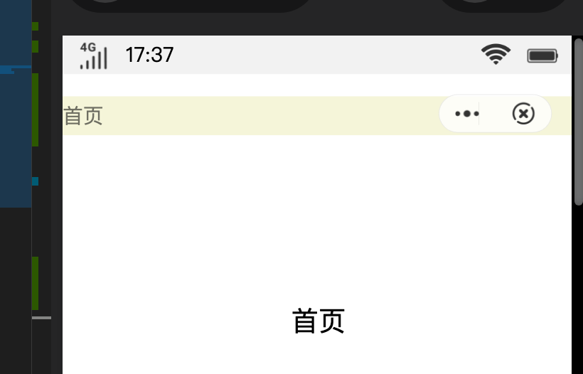

页面展示的标题除了可以自主设置外也可以隐藏不展示
```
// manifest.json文件
{
  "package": "com.mitu.app",
  "name": "米兔小说",
  ............
  "features": [
    ............
    {
      "name": "system.device"
    }
  ],
  ............
  "display": {
    ...........
    "pages": {
      "pages/home": {
        "titleBarText": "米兔",
        "titleBar": false
      },
      "pages/detail": {
        "titleBarText": "米兔"
      }
    }
  }
}
```
测试页面代码
```
<template>
  <!-- template里只能有一个根节点 -->
  <div class="wrapper">
    <div
      class="wrapper__nav"
      style="height:{{barInfo.menuBarHeight}}px;top:{{barInfo.menuBarTop + deviceInfo.windowHeight - $page.windowHeight}}px;"
    >
      <text class="wrapper__nav_name">首页</text>
    </div>
    <text class="title">{{ text }}</text>
    <text class="desc"
      >快应用是移动互联网新型应用生态，与手机系统深度整合，为用户提供更加场景化的体验。具备传统APP完整的应用体验，但无需安装、即点即用。
    </text>
    <text class="desc"
      >标准是由主流手机厂商组成的快应用联盟联合制定。其标准的诞生将在研发接口、能力接入、开发者服务等层面建设标准平台，以平台化的生态模式对个人开发者和企业开发者全品类开放
    </text>
    <input
      class="btn"
      type="button"
      value="欢迎使用"
      onclick="onWelcomeBtnClick"
    />
  </div>
</template>

<script>
import device from '@system.device'
export default {
  private: {
    text: '首页',
    barInfo: {},
    deviceInfo: {},
    screenDensity: 1
  },

  onWelcomeBtnClick() {
    $utils.showToast('快应用：复杂生活的简单答案，让生活更顺畅')
  },

  onReady() {
    device.getInfo({
      success:  (ret) => {
        console.log(`deviceInfo success`, ret);
        this.deviceInfo = ret;
        this.screenDensity = ret.screenDensity
      }
    })
    console.log('页面状态', this.$page)
    let temp = this.$page.getMenuBarRect();
    // temp 中返回的 menuBarTop 包括顶部的手机顶部状态栏(信号，电源)，暂叫做系统状态栏(systemStatusHeight)
    // 通过 $page.windowHeight - deviceInfo.windowHeight 能大抵得到 systemStatusHeight 的值
    // $page.windowHeight 是整个手机屏幕的高度，deviceInfo.windowHeight返回的是当前可用的高度
    // let temp = this.$page.getMenuBarBoundingRect();
    this.barInfo = temp;
    console.log('状态栏信息', this.barInfo)
  },
}
</script>

<style lang="less">
@import './../../assets/styles/style.less';

.wrapper {
  .flex-box-mixins(column, center, center);
  /* margin: 0 10 * @size-factor; */
  .title {
    font-size: 8 * @size-factor;
    text-align: center;
    color: @black;
  }
  .desc {
    margin-top: 10 * @size-factor;
    color: @grey;
  }
  .btn {
    width: 90 * @size-factor;
    height: 16 * @size-factor;
    border-radius: 8 * @size-factor;
    background-color: @brand;
    color: @white;
    font-size: 30px;
    margin-top: 16 * @size-factor;
  }

  &__nav {
    position: fixed;
    top: 0;
    left: 0;
    width: 750px;
    background-color: #f5f5dc;

    &_title {
      font-size: 20px;
      color: #333333;
    }
  }
}
</style>
```
最后效果

